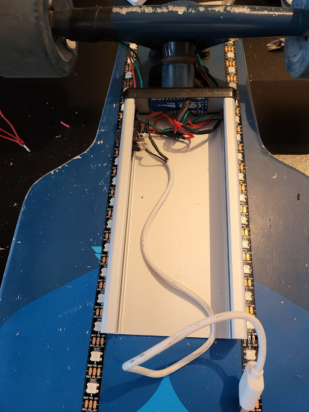
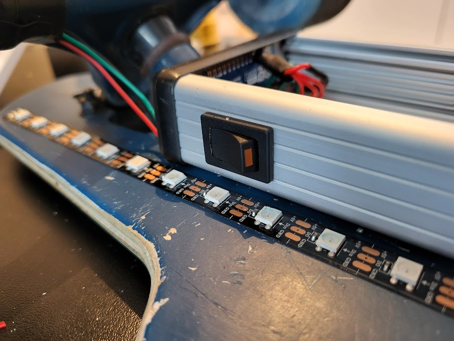
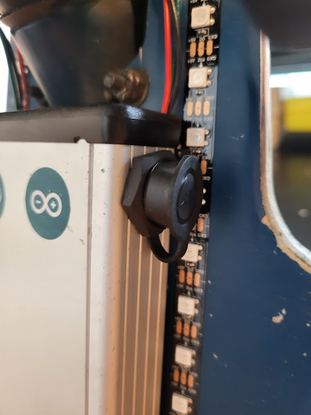
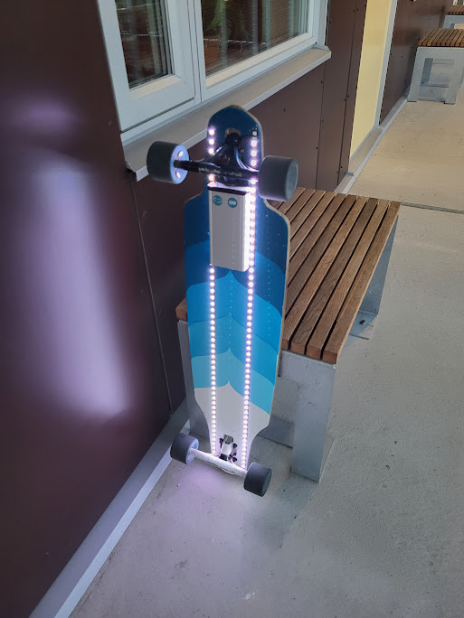
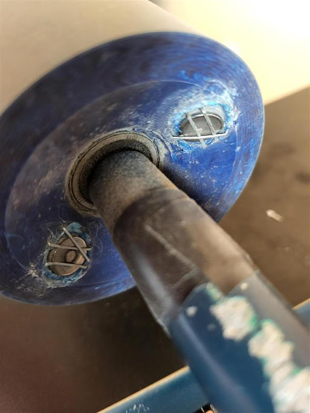

# Longboard Underlight
This is an old project to add dynamic light effects that mount to the underside of a longboard. 

    

# The hardware
I use an Arduino Nano Every for the microcontroller powered by a power bank. 
These are stored in an aluminum extruded box mounted to the underside of the longboard.

  
   
  

Two LED strips are mounted along the underside of the longboard and connected to the microcontroller.

    

Two magnets are mounted to the inside of one of the front wheels and a hall effect sensor senses them passing. 
This is used to estimate the board's current speed and the animation speed is set to be proportional to the estimated speed.

    

